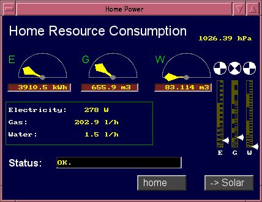

## MQTT-Hyperdash
<pre>
VERSION 1.02

(C) 2019-2020 by Markus Hoffmann
(kollo@users.sourceforge.net)

Name        : MQTT-Hyperdash
Version     : 1.02                              Author: Markus Hoffmann
Group       : Development/Languages             License: GPLv2
Packager    : Markus Hoffmann <kollo@users.sourceforge.net>
Summary     : A universal MQTT Dashboard.
Description :

This is a fast and efficient dashboard (GUI) for the MQTT framework. It uses
the SDL library for graphics rendering, the paho.mqtt.c library for communication and
the gtk2 framework for user input. The dashboard runs on Linux, 
but a port to other operating systems is possible. 

Special features:

* Very simple and basic set of base elements. 
* animated analog input elements, potentiometers.
* Fast update rates of 20 Hz are possible.
* Easy to use: Each panel/dashboard is configured in a single .dash file.

</pre>

This repository contains following set of applications: 

#### hyperdash 

hyperdash runs a panel/dashboard, which has been defined in a dash file. It
opens a window, draws all elements updates with each new topic message and takes
user input with the mouse to manipulate topics contents. 

A description of the [dash file format](doc/MQTT-Hyperdash-file-format.md) can
be found in the doc/ section.

#### dashdesign (HyperDash Dashboard Designer)

Dashdesign is a graphical tool to create and edit the .dash files. 

A brief explanation how to use dashdesign is in its man-page 
[dashdesign man-page](src/dashdesign.1).

The usage with the graphical interface should be more or less self-explanatory. 
But maybe you want to have a look at its 
[user manual](doc/MQTT-dashdesign-user-manual.md).

#### hddashgen (HyperDash Dashboard-Generator)

Making dashboard files by hand with a text editor can be a lot of annoying 
manual work. To help this, there is the tool hddashgen to automatically create
dash files from topic lists, so one has a good starting point to work with.
hddashgen will do this job in combination with mqtt-list-topics (see below).

The default appearance is derived from the topics names, if they follow a
naming convention. The naming convention used is explained in 
[Dashgen Naming Conventions](doc/MQTT-dashgen-naming-conventions.md).

A brief explanation how to use hddashgen is in its man-page 
[hddashgen man-page](src/hddashgen.1).

#### mqtt-list-topics

A tool to connect to a mqtt broker and list all topics available there to stdout. 

mqtt-list-topics also performs a brief analysis on the topics content to 
classify the topic into binary, string, number, and integer. This 
classification is not perfect, since it is based on a single payload value only, 
but it can help making automatic dashboards for MQTT-Hyperdash. 

A good starting point for the usage of mqtt-list-topics is its man-page 
[mqtt-list-topics man-page](src/mqtt-list-topics.1).

#### rule-engine sysmeasure and syslogger

Rule engines are meant to be applications running completely in the background. 
They do not interact directly with user. Their function is to subscribe to a 
set of topics, watch their updates and trigger a routine, which calculates 
something based on the input topics and finally publish the result to output
topics, which then can trigger other rules or rule engines. They also can
perform actions on the machine they are running, like executing shell scripts
when a topic content matches a certain pattern, or perform measurements by
accessing local hardware components and publish the results to the mqtt network.

With multiple rule engines running even on different computers using the same
broker, one can implement a full automation control, which would create the
Internet of Things. 

The concept of rule engines is not new and can be found in other automation
concepts as well. This  implementation is focused on high performance quick
reaction, and reliability. And the realization is not very complicated. Please
read the the [rule engine howto](doc/MQTT-rule-engine-howto.md) in
the doc/ section.

## Remarks

The project is not complete. Please see the file 
[CONTRIBUTING.md](CONTRIBUTING.md) how you can help to improve the project. 

I had the impression, an application like this was still missing in 2019. 
So I started this project. Please let me know, if I am right....

Also I am thinking of a
[MQTT payload convention](doc/MQTT-Hyperdash-payload-conventions.md)
. This could be a field for discussions. Please feel free to join.

## Installation

### Preparation

First you should make sure, that all necessary packages are installed. 
In doubt, do a 

<pre>
 sudo apt-get install libsdl-gfx1.2-dev libsdl1.2-dev libsdl-ttf2.0-dev
 sudo apt-get install libgtk2.0-dev 
</pre>

Also, it is essential, that the eclipse paho library 
(for the MQTT communication) is installed. 
Here is their homepage: https://www.eclipse.org/paho/

You will need the "C client library". Eclipse provides a download link
and installation instructions. However, if you do not want to install
binary packages, it is totally fine to start from the git repository:
https://github.com/eclipse/paho.mqtt.c

The "Build instructions for GNU Make" worked for me. Especially you should 
install the package libssl-dev.

<pre>
 sudo apt-get install libssl-dev
</pre>
 
And finally, you may want to install the core set of true type fonts:

<pre>
sudo apt-get install ttf-mscorefonts-installer
</pre>

(If you do not have this package installed, you can still use MQTT Hyperdash, 
but it would be necessary to specify an alternative font path.)

### Compilation

When this is prepared, to make MQTT-Hyperdash, 
you can simply do a 

<pre>
 cd src/
 make
 sudo make install
</pre>

## Test run

Open a terminal and do a 

<pre>
hyperdash main.dash &
</pre>

have fun....
