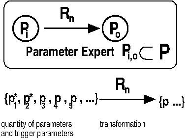
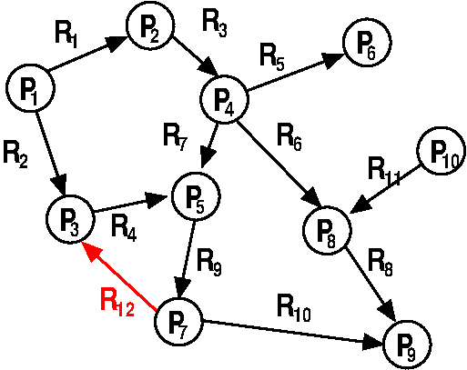

## MQTT Rule Engines

Here we summarize briefly what rule engines are and how you can use them to 
nicely implement abstraction layers into your data. We also point out 
how you can build a distributed and scalable computation network based on the 
MQTT data.

### Introduction

Rule engines are meant to be applications running completely in the background.
They run on one of many computers which are connected to each other by a 
computer network. Rule engines do not interact directly with the user. Their
function is to subscribe to a set of topics, watch their updates and trigger a
routine, which calculates  something based on the input topics and finally
publish the result(s) to output topics. The output topics then can trigger other
rules or rule engines. The rule engines also can perform actions on the machine
they are running, like executing shell scripts when a topic content matches a
certain pattern, or accessing the hardware connected.

A rule is a transformation algorithm together with a set of input parameters (or
topics) and a set of output parameters. A subset of the input parameters can
trigger the algorithm. The rule is usually triggered whenever the content of
such an input trigger-topic has changed. A rule algorithm is calculated in no
time (which means, the algorithm must not yield or halt its execution and must
process as fast as possible) and immedeately publishes its results.

A rule engine is a process running on any computer connected to the broker, 
which can execute one or more individual rules. 

With multiple rule engines running even on different computers using the same
broker, one can implement a full automation control, which would create the
Internet of Things. 
(See also: [MQTT Hyperdash automation concept](MQTT-Hyperdash-automation-concept.md))

All rules together form a rule network, or a rule graph.

Usually the rule graph is a directed graph, so that all calculations always
come to an end. If it is guaranteed, that the calculations eventually come to an 
end, then also cycles in that graph are allowed. The rule graph is therefor not
necessaryly a directed graph.

If the graph has cycles, this would mean, that the rules can trigger themselves
in an potentially endless loop. Except for special cases, the rule graph must be
designed to not have unintended cycles, otherwise the parameters have undefined
values and the whole rule subgraph becomes unstable. 

However, If you can make sure, that the cycle will always come to an end, e.g. 
when the algorithm as a whole converges on the input parameters, then a cycle 
might be an interesting concept to implement (slow) control loops for the 
automation.

The concept of rule engines is not new and can be found in other automation
concepts as well. 

The MQTT-Hyperdash implementation is focused on high performance, quick
reaction and reliability. In addition, using them is not very complicated. 

### MQTT-Hyperdash rule engines

MQTT-Hyperdash provides a framework with which you can very quickly define 
and program rule engines. You only need to specify the main code fraction 
of your algorithm, and the framework will take care of collecting all data,
trigger your routines and publish the results. For the rule itself the data 
is available as if they were stored in normal variables to calculate with. No 
communication overhead need to be programmed. The performace is hence as high
as all other programs written in C, the language all successful computer 
operating systems are written in. We have chousen the C language for performace
reasons. As a result, the rules (defined in the .rule files) are valid C 
code and will be processed by the C compiler. 

You can make three kinds of rule engines:

1. An engine which will be triggered on changes of a set of topics and then 
   perform any action an the local machine (interact with the hardware, 
   perform switching tasks, execute external programs or shell scripts, or
   simply log the data and write them to a file or database. 

2. An engine which performs measurement tasks in a loop and publishes the
   measured results to the MQTT-Network. The rule itself needs to perform the 
   measureing code, access the hardware, do calculations. The results are 
   stored in a data area and the framework takes care of publishing it. The
   frequency wuth which the measured values are published is completely
   determined by the measurement task itself. It can be regularly or even on an
   event basis. 

3. An engine which waits for triggers from a set of input topics, use even more
   topics data (without been triggered by it) and then calculate something. The
   results are stored in a data area and the framework takes care of 
   publishing it. All data is transparently available to the rule itself 
   as if it was normal variable content. 

The three kinds are not sharply separated. Any grade of mixture of these three
base concepts can be realized. The rule engine framework allows to stuff any 
number of individual rules into a single process (executable).

There are four example rules provided with this package to demonstrate the usage
in any of these cases:

1. sysmeasure.rule
   This rule measures the computer RAM usage as well as the disk usage and system
   load every second and publishes the results to the broker. 

2. syslogger.rule
   This rule subscribes to the topics of sysmeasure.rule and logs the 
   data and writes them into files (one for each day), so that the data can be
   visualized e.g. with gnuplot. 

3. commander.rule
   This rule listens for changes on two input topics 
   (HOME/SOLAR/LADE/CMD_DC and HOME/SOLAR/LADE/CMD_SC). It accepts the numeric 
   values 0 and 1 on the first topic as well as the strings "ON" and "OFF" on the
   second to perform shell scripts accordingly (which would send commands to a
   433~MHZremote power plug of run on a Raspberry PI).

4. demo.rule
   This rule is the simplest rule which listens to two topics DEMO/A and DEMO/B
   and calculated the sum of both whenever the content of one of them changes
   and publish its result (the sum) to DEMO/C.

### The framework

The rule engine framework, with which the rule programmer will not come in touch
subscribes to all TOPICs defined and collects permanently all data which
arrives. If a trigger TOPIC gets a message, a snapshot of all data available at
that time on every TOPIC defined is collected into a snapshot data structure and
the rule function is executed. The results are expected to be stored in the
snapshot data structure and finally the framework publishes the content of the
defined output TOPICs, but only if the content has changed! If the rule comes
to the same results, it will not get published again. This prevents other rules
to be triggered unnecessarily with the same value and also saves network 
bandwidth.

### Quick Guide: demo.rule

You want to have a look at src/demo.rule. This es everything needed to implement
and make a simple rule. The rule will be compiled into a native executable with

<pre>
make demo
</pre>

The file demo now can be executed, but it should not print anything to the
terminal console, because besides debug messages there is no direct output or
input via the console. 

If you see an error message, make sure that you run a broker on the 
machine (localhost) and that the access rights are correct.

You can as well execute demo in the background, e.g.
like this:

<pre>
./demo 2>&1 >> /tmp/demo.log &
</pre>

I have put mine in the crontab, so the automatically start at boot 
(on a Raspberry pi):
<pre>
@reboot /home/pi/bin/demo --persist 2>&1 > /dev/null
</pre>

The "--persist" option makes the rule engine not giving up on connecting to 
the MQTT-broker even when the broker server is not yet available a atartup 
time of the rule engine. 

#### The magic

The magic not happens in the background. To see what happens, 
please open three terminal windows:

In window number 1 please run 
<pre>
 mosquitto_sub -h localhost -t DEMO/ACTIVITY_DM 
</pre>

If demo is running, you should see an update here every second counting from 0
to 3. This indicates that the demo engine is running. (Maybe you want to make 
a dashboard, and put DEMO/ACTIVITY_DM to a BITMAPLABEL ...)

Now open terminal window number 2 and run
<pre>
 mosquitto_sub -h localhost -t DEMO/C 
</pre>

and in windows number 3 please enter

<pre>
  mosquitto_pub -h localhost -t DEMO/A -m 12
  mosquitto_pub -h localhost -t DEMO/B -m 10
</pre>

You should find the results update in window number 2. 

Thats magic. Now you should be creative and think what you 
can do with this mechanism. 

I do
* calculate the filling percentage of a battery out of the voltage measured,
* Do a rescaling of values from mSv/d to µSv/h.
* Have shell commands executed on a remote machine whenever I press a button on
  a MQTT-Hyperdash dashboard.
* Recalculate and rescale the data for a plot in a dashboard whenever the 
  user sets a different scaling for X or Y.

The rule engines consume nearly no CPU power, they are so fast, that changes are
instantly trigger calculations on the fly. You can therefore run many (say 10 to
20) of them on a very weak Raspberry Pi. 

### Writing own rules

You should take demo.rule as a template and modify it according to your needs.
Also the other tree example rules provided are not very complicated and could
serve you as a basis for your own tasks.

The rule syntax is C with some predefined macros. Rule files are actually
original C files and they are compiled with gcc. So you can add any
sub-function you need for calculation. And the stdlib including math is readily
available. 

This way the execution of the rule function can be very fast, and there are 
nearly no limitations.

For advanced use, the rule definitions allow an initialization functions which 
is called once at startup of the rule engine executable and can pass
command-line parameters, ask for environment variables or open configuration
files, if needed. The demo rule does not make use of it.

Initrule gets the parameters (argc,argv) from the main function.

The rules are defined by filling an Array of data structures of following
type:

<pre>
typedef struct {
  PARMDEF *params; /* The List of parameters/topics */
  int numparms;    /* Number of parameters defined*/
  void (*initrule)(); /* The initialization rule */
  void (*rule)();     /* The trigger rule */
} RULEDEF;
</pre>

The input and output topics of the rule are defined using this struct:

<pre>
typedef struct {
  int type;     /* Type of the parameter, a combination of 
                   PARM_IN PARM_TRIGGER PARM_OUT PARM_ISNUMBER*/
  char *topic;  /* The topics name */
  int qos;      /* The Quality of Service to be used for 
                   subscription and publication*/
  int sub;      /* In index to the subscription table, initialize with 0*/
  char *format; /* A format string to format floating point numbers to 
                   the topics content, BASIC like or printf-like */
} PARMDEF;
</pre>

Maybe interesting is the qos parameter. It can make sense to set it to 2 in cases
where the trigger must not get lost and must occur not more than once. 
However this slows the rules down quite a lot. 

The rule takes the snapshot with the parameter contents using an array of this 
struct:

<pre>
typedef struct {
  double value;  /* for numeric params */
  STRING string; /* for raw or string params */
} PARMBUF;
</pre>

Where STRING is a very simple structure to hold a number of bytes:

<pre>
typedef struct {
  unsigned int len;
  char *pointer;
} STRING;
</pre>

Thats probably all you need to know about the underlying rule engine framework.

If you have questions or problems using this framework, please feel free to 
discuss this in the issues forum of this repository.
